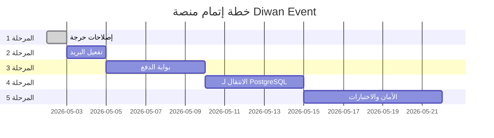

# 🗺️ خطة إتمام منصة Diwan Event — من MVP إلى SaaS

> **تاريخ الإعداد:** 2026-05-01  
> **المدة التقديرية:** 5 مراحل × أسبوع واحد = **5 أسابيع**  
> **الأولوية:** من الأعلى حرجية إلى الأدنى

---

## المرحلة 1: الإصلاحات الحرجة الفورية ⏰ (يوم واحد)

> [!CAUTION]
> هذه أخطاء يجب إصلاحها **قبل أي شيء آخر**. بدونها، بعض الوظائف ستتعطل.

### المهمة 1.1 — إصلاح `analytics.py` (الخطأ الحرج)
- [ ] إضافة `from database import get_db_connection` في أعلى الملف
- [ ] اختبار يدوي للمسار `/api/analytics`
- **الجهد:** 5 دقائق

### المهمة 1.2 — تصحيح مسارات أيقونات PWA
- [ ] في `marketing.html`: تصحيح `<link rel="apple-touch-icon" href="/static/icon-192.png">`
- [ ] أو نسخ الأيقونات إلى مجلد `/assets/` ليتطابق مع المسار الحالي
- [ ] التأكد من أن `manifest.json` و `marketing.html` يشيران لنفس المسارات
- **الجهد:** 10 دقائق

### المهمة 1.3 — إضافة صفحة 404 مخصصة
- [ ] إنشاء `templates/404.html` بتصميم يناسب الهوية البصرية
- [ ] إضافة Exception Handler في `main.py` لـ 404
- **الجهد:** 30 دقيقة

### المهمة 1.4 — توحيد اسم التطبيق
- [ ] مراجعة `manifest.json`: تغيير `short_name` من "ديوان" إلى "Diwan Event"
- [ ] مراجعة جميع الصفحات للتأكد من ظهور "Diwan Event" بشكل موحّد
- **الجهد:** 15 دقيقة

---

## المرحلة 2: تفعيل البريد الإلكتروني 📧 (يومان)

> [!IMPORTANT]
> بدون البريد، لا يستلم المشارك تأكيداً أو تذكرته الرقمية.

### المهمة 2.1 — إعداد خدمة SMTP
- [ ] اختيار مزوّد البريد:
  - **الخيار أ:** Gmail App Password (مجاني، سريع، محدود بـ 500 رسالة/يوم)
  - **الخيار ب:** Brevo/Sendinblue (مجاني حتى 300 رسالة/يوم، أكثر موثوقية)
  - **الخيار ج:** Mailgun (مجاني أول 5000 رسالة، الأنسب للإنتاج)
- [ ] إضافة المتغيرات في `.env`:
  ```
  SMTP_SERVER=smtp.gmail.com
  SMTP_PORT=587
  SMTP_USERNAME=events@diwanevent.com
  SMTP_PASSWORD=xxxx-xxxx-xxxx-xxxx
  ```

### المهمة 2.2 — تحديث `notifications.py`
- [ ] تعديل رابط التذكرة ليقرأ من متغير بيئة `APP_DOMAIN` بدل `localhost:8000`
- [ ] إضافة retry logic (محاولة إعادة الإرسال عند الفشل)
- [ ] إضافة Template بريد إلكتروني للتسجيل + آخر للتذكرة
- [ ] اختبار إرسال حقيقي لبريد تجريبي

### المهمة 2.3 — إضافة إشعار بريد عند تأكيد الدفع
- [ ] ربط `mock_payment_webhook` بإرسال بريد تأكيد بعد الدفع الناجح

---

## المرحلة 3: بوابة الدفع الإلكتروني 💳 (3-5 أيام)

### المهمة 3.1 — اختيار بوابة الدفع
| البوابة | المميزات | العمولة | التوصية |
|---------|---------|---------|---------|
| **Chargily Pay** | تدعم CIB + Edahabia + API بسيط | 2.5% | ✅ **الأفضل للجزائر** |
| **Stripe** | دولية، لا تدعم DZD مباشرة | 2.9% + 0.30$ | للعملاء الدوليين |
| **PayPal** | معروفة عالمياً | 3.49% + 0.49$ | كخيار ثانوي |

### المهمة 3.2 — التكامل مع Chargily Pay
- [ ] إنشاء حساب تاجر على [Chargily](https://pay.chargily.com)
- [ ] الحصول على `API_KEY` و `API_SECRET`
- [ ] إعادة كتابة `payments.py`:
  ```python
  # الهيكل المطلوب:
  class ChargilyGateway:
      async def create_checkout(participant_id, amount, back_url):
          # POST to Chargily API
          # Return checkout URL
      
      async def handle_webhook(request):
          # Verify signature
          # Update payment_status
          # Send confirmation email
  ```
- [ ] إضافة المتغيرات في `.env`:
  ```
  CHARGILY_API_KEY=xxxx
  CHARGILY_API_SECRET=xxxx
  PAYMENT_SUCCESS_URL=https://diwanevent.com/ticket/{qr_code}
  ```

### المهمة 3.3 — واجهة الدفع
- [ ] تعديل `/mock-payment` لتصبح `/payment/checkout` حقيقية
- [ ] إضافة صفحة `/payment/success` و `/payment/cancel`
- [ ] ربط Webhook الحقيقي `POST /api/webhooks/payment`

### المهمة 3.4 — اختبار شامل لدورة الدفع
- [ ] تسجيل مشارك → توجيه للدفع → تأكيد → استلام التذكرة
- [ ] اختبار حالة الفشل والإلغاء

---

## المرحلة 4: الانتقال لـ PostgreSQL 🐘 (3-5 أيام)

> [!WARNING]
> هذه المرحلة هي الأكثر حساسية. يجب أخذ نسخة احتياطية كاملة قبل البدء.

### المهمة 4.1 — توحيد طبقة قاعدة البيانات
- [ ] إعادة كتابة `database.py` ليستخدم SQLAlchemy + Models من `models.py`
- [ ] **الدوال المطلوب تحويلها:**

| الدالة | الوصف | الأولوية |
|--------|-------|---------|
| `init_db()` | تهيئة الجداول | 🔴 |
| `get_db_connection()` | استبدال بـ `SessionLocal()` | 🔴 |
| `get_stats()` | إحصائيات الحضور | 🔴 |
| `get_participant_by_qr()` | بحث بالـ QR | 🔴 |
| `get_participant_by_order()` | بحث بالرقم | 🔴 |
| `search_participants()` | بحث عام | 🔴 |
| `add_attendance()` | تسجيل حضور | 🔴 |
| `get_attendance_history()` | سجل الحضور | 🟡 |
| `register_public_participant()` | تسجيل عام | 🟡 |
| `add_manual_participant()` | إضافة يدوية | 🟡 |
| CRUD: agenda, speakers, hotels, ratings | إدارة المحتوى | 🟡 |

### المهمة 4.2 — تحديث `main.py`
- [ ] تغيير جميع الاستيرادات من `database` القديم إلى النظام الجديد
- [ ] استبدال `conn.execute(SQL)` بـ `db.query(Model).filter(...)`
- [ ] إضافة `event_id` filter لكل الاستعلامات

### المهمة 4.3 — تحديث `analytics.py`
- [ ] تحويل استعلامات SQL الخام إلى SQLAlchemy ORM

### المهمة 4.4 — اختبار الترحيل
- [ ] تشغيل `migrate_to_pg.py` مع قاعدة بيانات تجريبية
- [ ] التأكد من صحة البيانات المرحّلة
- [ ] اختبار كل مسار API بعد الترحيل

### المهمة 4.5 — تحديث `backup_manager.py`
- [ ] تعديل من نسخ ملف SQLite إلى `pg_dump` لـ PostgreSQL

---

## المرحلة 5: تعزيز الأمان والاختبارات 🔒 (أسبوع)

### المهمة 5.1 — نظام تسجيل دخول متعدد المستخدمين
- [ ] إنشاء صفحة تسجيل `/register` للمنظمين
- [ ] تفعيل نموذج `User` من `models.py` (الموجود مسبقاً)
- [ ] دعم الأدوار: `super_admin`, `admin`, `scanner`, `viewer`
- [ ] تشفير كلمات المرور بـ `bcrypt`
- [ ] تعديل middleware الجلسات ليدعم تعدد المستخدمين

### المهمة 5.2 — كتابة الاختبارات
- [ ] إنشاء مجلد `tests/`
- [ ] كتابة اختبارات لـ:
  ```
  tests/
  ├── test_auth.py          # تسجيل الدخول والصلاحيات
  ├── test_attendance.py    # Check-in / Check-out
  ├── test_registration.py  # تسجيل المشاركين
  ├── test_payments.py      # دورة الدفع
  └── test_api.py           # اختبار كل مسار API
  ```
- [ ] تفعيل `pytest` في `deploy.yml` بدل `echo`

### المهمة 5.3 — تحسينات أمنية
- [ ] إضافة CORS Middleware مع تحديد الدومينات المسموحة
- [ ] إضافة HTTPS enforcement في الإنتاج
- [ ] تشفير `SECRET_KEY` بقيمة عشوائية قوية (32+ حرف)
- [ ] إضافة Content Security Policy headers

---

## 🗓️ الجدول الزمني المقترح



---

## 📋 ملخص سريع

| المرحلة | المدة | الأثر على المنتج |
|---------|-------|-----------------|
| 1. إصلاحات حرجة | يوم واحد | يمنع تعطل الوظائف الحالية |
| 2. البريد الإلكتروني | يومان | يفعّل تجربة المشارك الكاملة |
| 3. بوابة الدفع | 5 أيام | يفتح باب التحصيل المالي |
| 4. PostgreSQL | 5 أيام | يجعل المنصة جاهزة للإنتاج |
| 5. الأمان والاختبارات | أسبوع | يضمن الاستقرار والموثوقية |

> [!TIP]
> **نصيحة تسويقية:** يمكنك إطلاق المنصة بعد المرحلة 3 مباشرة كـ "Early Access" مع الباقة المجانية فقط، وإضافة الباقات المدفوعة بعد اكتمال المرحلة 4.
